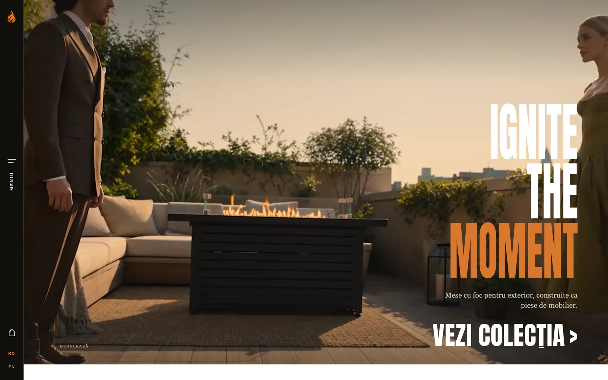
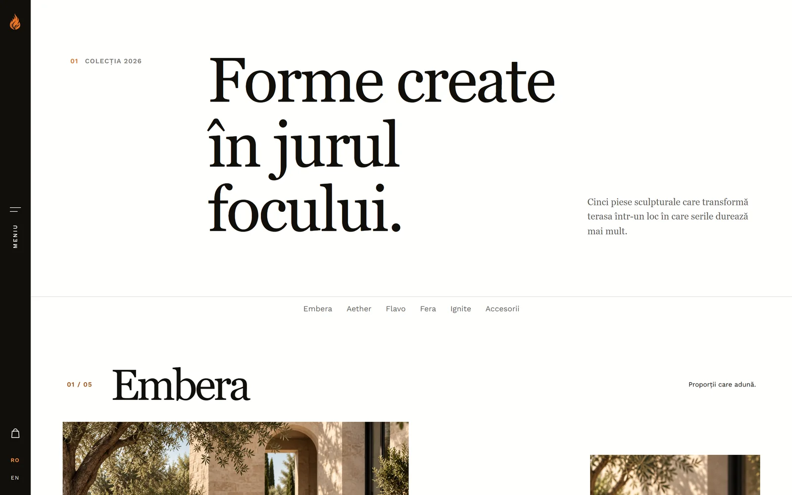

# PureFlame

Site de prezentare și magazin online pentru o colecție de mese cu foc pe gaz, construit ca **proiect de portofoliu**. Brandul și produsele sunt fictive, nu există stoc, clienți sau vânzări reale, iar plățile rulează doar în **Stripe test mode**.

Proiectul combină un front-end editorial (design, animații, responsive) cu un backend Node.js care procesează comenzi, plăți, newsletter, contact și recenzii.

**Demo online (doar front-end):** https://pureflame-portofolio-editorial.vercel.app/ — pe Vercel rulează doar paginile statice. Plata, formularul de contact, newsletter-ul și recenziile au nevoie de backend și funcționează doar local (vezi „Instalare și rulare").

## Capturi





## Ce este implementat

**Front-end** (HTML, CSS și JavaScript vanilla, fără framework sau bundler)
- 15 pagini servite (acasă, colecție, 5 pagini de produs, despre noi, coș, finalizare comandă, confirmare, newsletter, termeni, confidențialitate, retur) și o pagină 404.
- Comutator de limbă RO/EN, galerii de produs, vizualizare 3D a produselor, animații la scroll și coș de cumpărături salvat în `localStorage`.
- Layout responsive, cu header și navigare adaptate pentru mobil.

**Back-end** (Node.js + Express)
- **Comenzi și plăți:** coșul multi-produs ajunge la Stripe Checkout (card, Apple Pay, Google Pay). Prețurile se calculează pe server, din catalogul din `server/products.js`; valorile trimise de browser sunt ignorate.
- **Webhook Stripe** cu verificarea semnăturii. O comandă devine „paid" doar prin webhook, niciodată prin pagina de confirmare.
- **Newsletter** cu dublă confirmare, dezabonare prin token și păstrarea dovezii de consimțământ (text, moment, IP).
- **Formular de contact** și **recenzii** cu moderare (o recenzie apare public doar după aprobare).
- **Email** prin Nodemailer. Fără SMTP configurat, mesajele sunt doar afișate în consolă.
- **Bază de date SQLite** (`node:sqlite`, fără dependență externă) și scripturi de backup/restore cu compresie și criptare AES-256-GCM opțională.

**Securitate** (verificată prin teste)
- Validare strictă pe server (tip, lungime, format), limite pentru dimensiunea cererilor.
- Rate limiting pe fiecare endpoint, `helmet` cu Content Security Policy strict, fără CORS.
- Se servește doar o listă albă de pagini și `/assets`, nu rădăcina proiectului.
- Erorile către client sunt generice, fără stack trace.

## Tehnologii

| Zonă | Tehnologie |
|---|---|
| Front-end | HTML5, CSS, JavaScript (vanilla), GSAP pentru animații, scenă 3D pentru produse |
| Back-end | Node.js ≥ 22.5, Express 4 |
| Bază de date | SQLite (`node:sqlite`) |
| Plăți | Stripe Checkout + webhook |
| Email | Nodemailer |
| Securitate | helmet, express-rate-limit |
| Teste | `node:test` (test runner nativ Node) |

## Instalare și rulare

Cerințe: Node.js 22.5 sau mai nou.

```bash
npm install
cp .env.example .env
```

Completează în `.env` cheile Stripe de **test** (`STRIPE_SECRET_KEY`, din Dashboard → Developers → API keys). Apoi pornește serverul:

```bash
npm run dev
```

Site-ul rulează la `http://localhost:3000`. Deschide-l mereu prin server, nu direct din fișierele HTML.

### Testarea plății (Stripe test mode)

1. Într-un al doilea terminal, instalează [Stripe CLI](https://docs.stripe.com/stripe-cli) și rulează `stripe login`, apoi:
   ```bash
   stripe listen --events checkout.session.completed,checkout.session.expired --forward-to localhost:3000/api/webhook
   ```
2. Copiază secretul `whsec_...` afișat în `.env`, la `STRIPE_WEBHOOK_SECRET`, și repornește serverul.
3. Adaugă un produs în coș, mergi la finalizare și plătește cu cardul de test `4242 4242 4242 4242` (orice dată viitoare și orice CVC).

Fără webhook, plata trece la Stripe, dar comanda rămâne „pending" și pagina de confirmare nu o găsește.

### Teste și backup

```bash
npm test          # 45 de teste: coș, validare, securitate, webhook
npm run backup    # copie comprimată (și criptată, dacă ai BACKUP_ENCRYPTION_KEY) a bazei de date
```

## Structura proiectului

```
*.html            paginile site-ului
assets/           CSS, JS, imagini, fonturi, video
server/           index.js (aplicația), routes/, db.js, email.js, products.js, validation.js
scripts/          backup/restore al bazei de date și sursa vizualizării 3D (product-viewer/)
test/             teste automate
docs/             capturi de ecran și documentație explicată pe înțeles (docs/documentatie/)
```

## Limite cunoscute

- **Nu este în producție.** Demo-ul de pe Vercel e doar front-end (rutele `/api/...` răspund 404 acolo). Pentru un deploy complet ar fi necesare un host pentru Node, un domeniu, SMTP real și programarea backup-ului.
- **Doar plată online prin Stripe.** Plata ramburs a fost scoasă intenționat.
- **Nu are panou de administrare.** Comenzile, mesajele și recenziile se citesc direct din baza de date. Moderarea recenziilor se face manual.
- **Comenzile abandonate** devin „expired" după ce expiră sesiunea Stripe (24 de ore), dar datele clientului rămân în baza de date. Nu există încă o curățare automată.
- **Nu are integrare continuă (CI)** în acest moment.
- **Nu are audit de accesibilitate** efectuat (Lighthouse/axe) și nici teste end-to-end în browser.
- Prețurile și produsele sunt fictive și nu corespund unei oferte reale.
- **Recenziile de pe paginile de produs sunt demonstrative** (text generat pentru portofoliu, definit în `assets/js/product-reviews.js`). Nu provin de la clienți reali. Formularul de recenzii funcționează și salvează recenziile noi spre moderare în baza de date.
